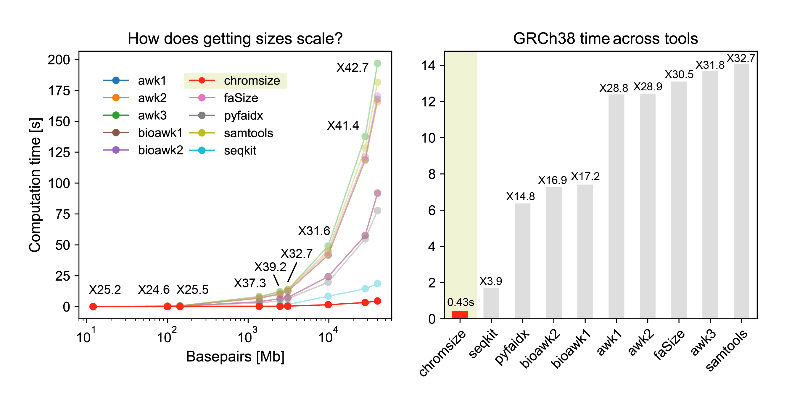

<p align="center">
  <h1 align="center">
    chromsize
  </h1>

  <p align="center">
    <a href="https://img.shields.io/badge/version-0.1.0dev-green" target="_blank">
      
    </a>
    <a href="https://crates.io/crates/chaintools" target="_blank">
      
    </a>
    <a href="https://github.com/alejandrogzi/chaintools" target="_blank">
      
    </a>
    <a href="https://crates.io/crates/chaintools" target="_blank">
      
    </a>
  </p>


  <p align="center">
    annoyed to have to create an index and cut it? <br>
    have to look for that old script every time? <br>
    got you. just get your chrom sizes. very fast.
  </p>


but first, how is this better than any other option? yeah, just check the image below.

</p>

<p align="center">
    
</p>


googled 'get chromosome sizes from fasta', grab every command/tool I found and benchmarked it. surprisingly, you can lose 14 seconds of your life just waiting for those chrom sizes to be calculated. crazy.

> What's new on v.0.0.2?
> - now reads .gz!
> - CI implementation

## Usage
### Binary
``` rust
Usage: chromsize --fasta <FASTA> --output <OUTPUT> [-t <THREADS>]

Arguments:
    -f, --fasta <FASTA>: FASTA file
    -o, --output <OUTPUT>: path to chrom.sizes

Options:
    -t, --threads <THREADS>: number of threads [default: your max ncpus]
    --help: print help
    --version: print version
```
#### crate: [https://crates.io/crates/chromsize](https://crates.io/crates/chromsize)

### Installation
to install rust and use chromsize on your system follow this steps:
1. get installer: `curl https://sh.rustup.rs -sSf | sh` on unix, or go [here](https://www.rust-lang.org/tools/install) for other options
2. run `cargo install chromsize` (make sure `~/.cargo/bin` is in your `$PATH` before running it)
4. use `chromsize` with the required arguments


### Library
``` rust
use chromsize;

fn main() {
    let input = PathBuf::new("/path/to/fasta.fa");
    let output = PathBuf::new("/path/to/chrom.sizes");

    let sizes: Vec<(String, u64)> = chromsize::chromsize(&input);
    chromsize::write(sizes, &output)
}
```
### Python
build the port to install it as a pkg:
```
git clone https://github.com/alejandrogzi/chromsize.git && cd chromsize/py-chromsize
hatch shell
maturin develop --release
```
use it as a binary wrapper:
``` python3
import chromsize as cs

input = "/path/to/fasta.fa"
output = "/path/to/chrom.sizes"
cs.write_chromsizes(input, output)
```
or just get them directly
``` python3
import chromsize as cs

input = "/path/to/fasta.fa"
sizes = cs.get_chromsizes(input)

>>> print(sizes)
[
    ('chr1', 123),
    ('chr2', 456),
    ...
]
```

## Build
to build chromsize from this repo, do:

1. get rust
2. run `git clone https://github.com/alejandrogzi/chromsize.git && cd chromsize`
3. run `cargo run --release -- -i <GTF> -o <OUTPUT>`

## Container image
to build the development container image:
1. run `git clone https://github.com/alejandrogzi/chromsize.git && cd chromsize`
2. initialize docker with `start docker` or `systemctl start docker`
3. build the image `docker image build --tag chromsize .`
4. run `docker run --rm -v "[dir_where_your_fa_is]:/dir" chromsize -f /dir/<INPUT> -o /dir/<OUTPUT>`

> ## Conda (not available yet)
> to use chromsize through Conda just:
> 1. `conda install chromsize -c bioconda` or `conda create -n chromsize -c bioconda chromsize`

> ## Nextflow (not available yet)

## Benchmark

do not believe me? run the benchmark on your own:

1. get .fa from any species you want (or download the ones I used from UCSC/NCBI)
2. install hyperfine: [https://github.com/sharkdp/hyperfine](https://github.com/sharkdp/hyperfine)
3. go to chromsize/bench and modify the `ASSEMBLIES` const with the .fa you've download
4. run `cargo run release --bin chromsize-benchmark -- -d /dir/where/my/fastas/are -a show-output ignore-failure`

here is all the info and metadata from my experiment:

### which tools I used?

| Tool      | Command                                                                                                          | Reference | Discussion |
|-----------|------------------------------------------------------------------------------------------------------------------|-----------|------------|
| seqkit    | `seqkit fx2tab --length --name --header-line {assembly} > chrom.sizes`                                           | [1]       | [2]        |
| chromsize | `target/release/chromsize -f {assembly} -o chrom.sizes`                                                          | [3]       |            |
| pyfaidx   | `faidx {assembly} -i chromsizes > chrom.sizes`                                                                   | [4]       | [5]        |
| samtools  | `samtools faidx {assembly} && wait \| cut -f1,2 {assembly}.fai > chrom.sizes`                                      | [6]       | [5]        |
| faSize    | `faSize -detailed -tab {assembly} > chrom.sizes`                                                                 | [7]       |            |
| awk1      | `awk '/^>/ {if (seqlen){print seqlen}; print ;seqlen=0;next; } { seqlen += length($0)}END{print seqlen}' {assembly} > chrom.sizes` | [8]       | [9]        |
| awk2      | `awk '/^>/{if (l!=") print l; print; l=0; next}{l+=length($0)}END{print l}' {assembly} > chrom.sizes`             | [8]       | [9]        |
| bioawk1   | `bioawk -c fastx '{print > $name ORS length($seq)}' {assembly} > chrom.sizes`                                     | [10]      | [9]        |
| awk3      | `cat {assembly} \| awk '$0 ~ > {if (NR > 1) {print c;} c=0;printf substr($0,2,100) "\t"; } $0 !~ ">" {c+=length($0);} END { print c; }' > chrom.sizes` | [8]       | [11]       |
| bioawk2   | `bioawk -c fastx '{ print $name, length($seq) }' < {assembly} > chrom.sizes`                                      | [10]      | [2]        |

[1]: https://github.com/shenwei356/seqkit
[2]: https://www.biostars.org/p/118954/
[3]: https://github.com/alejandrogzi/chromsize
[4]: https://github.com/mdshw5/pyfaidx
[5]: https://www.biostars.org/p/173963/
[6]: https://github.com/samtools/samtools
[7]: https://github.com/ENCODE-DCC/kentUtils/blob/master/bin/linux.x86_64/faSize
[8]: https://www.gnu.org/software/gawk/manual/gawk.html
[9]: https://stackoverflow.com/questions/23992646/sequence-length-of-fasta-file
[10]: https://github.com/lh3/bioawk
[11]: https://www.danielecook.com/generate-fasta-sequence-lengths/

### detailed data?

| Species        | Assembly    | Size (Gb) | chromsize | seqKit        | awk1          | awk2          | awk3          | bioawk1        | bioawk2        | faSize        | pyfaidx        | samtools       |
|----------------|-------------|-----------|-----------|---------------|---------------|---------------|---------------|----------------|----------------|---------------|----------------|----------------|
| S. cerevisiae  | R64         | 0.01      | 0.004     | 0.016 (X 4.0) | 0.043 (X 10.7)| 0.043 (X 10.7)| 0.05 (X 12.5) | 0.03 (X 7.5)   | 0.03 (X 7.5)   | 0.054 (X 13.5)| 0.101 (X 25.2) | 0.064 (X 16.0) |
| C. elegans     | ce11        | 0.10      | 0.02      | 0.103 (X 5.1) | 0.409 (X 20.4)| 0.408 (X 20.4)| 0.492 (X 24.6)| 0.274 (X 13.7) | 0.274 (X 13.7) | 0.426 (X 21.3)| 0.225 (X 11.2) | 0.472 (X 23.6) |
| D. melanogaster| dm6         | 0.14      | 0.028     | 0.147 (X 5.2) | 0.581 (X 20.7)| 0.583 (X 20.8)| 0.714 (X 25.5)| 0.426 (X 15.2) | 0.418 (X 14.9) | 0.633 (X 22.6)| 0.337 (X 12.0) | 0.667 (X 23.8) |
| D. rerio       | danRer11    | 1.37      | 0.22      | 0.742 (X 3.4) | 6.815 (X 31.0)| 6.803 (X 30.9)| 8.216 (X 37.3)| 3.946 (X 17.9) | 3.95 (X 18.0)  | 7.202 (X 32.7)| 3.029 (X 13.8) | 7.633 (X 34.7) |
| C. familiaris  | canFam4     | 2.48      | 0.311     | 1.209 (X 3.9) | 10.158 (X 32.7)| 10.124 (X 32.6)| 12.206 (X 39.2)| 6.55 (X 21.1)  | 6.518 (X 21.0) | 10.671 (X 34.3)| 4.741 (X 15.2) | 11.394 (X 36.6)|
| H. sapiens     | GRCh38      | 3.10      | 0.43      | 1.696 (X 3.9) | 12.393 (X 28.8)| 12.432 (X 28.9)| 13.681 (X 31.8)| 7.414 (X 17.2) | 7.284 (X 16.9) | 13.102 (X 30.5)| 6.37 (X 14.8)  | 14.074 (X 32.7)|
| B. bombina     | aBomBom1    | 9.80      | 1.554     | 8.501 (X 5.5) | 41.676 (X 26.8)| 41.696 (X 26.8)| 49.064 (X 31.6)| 24.202 (X 15.6)| 24.374 (X 15.7)| 43.856 (X 28.2)| 19.755 (X 12.7)| 45.387 (X 29.2)|
| A. mexicanum   | AmbMex60DD  | 28.20     | 3.327     | 14.375 (X 4.3)| 118.923 (X 35.7)| 118.422 (X 35.6)| 137.781 (X 41.4)| 57.626 (X 17.3)| 57.591 (X 17.3)| 121.257 (X 36.4)| 54.82 (X 16.5) | 128.374 (X 38.6)|
| P. annectens   | PAN1.0      | 40.10     | 4.606     | 18.664 (X 4.1)| 167.85 (X 36.4)| 165.701 (X 36.0)| 196.833 (X 42.7)| 91.747 (X 19.9)| 91.924 (X 20.0)| 170.475 (X 37.0)| 77.707 (X 16.9)| 181.562 (X 39.4)|

### how well performs with .gz?

#### CHM13-T2T.fa.gz

| Tool      | Cores                      | Time                   |
|-----------|----------------------------|------------------------|
| seqkit    | 16                         | 18.993 s ± 0.132 s     |
| chromsize | default (max_cpus: 16)     | 7.631 s ± 0.010 s      |
| seqkit    | default (4)                | 18.525 s ± 0.520 s     |
| chromsize | 4                          | 8.035 s ± 0.077 s      |
| seqkit    | 2                          | 18.535 s ± 0.376 s     |
| chromsize | 2                          | 8.284 s ± 0.030 s      |

